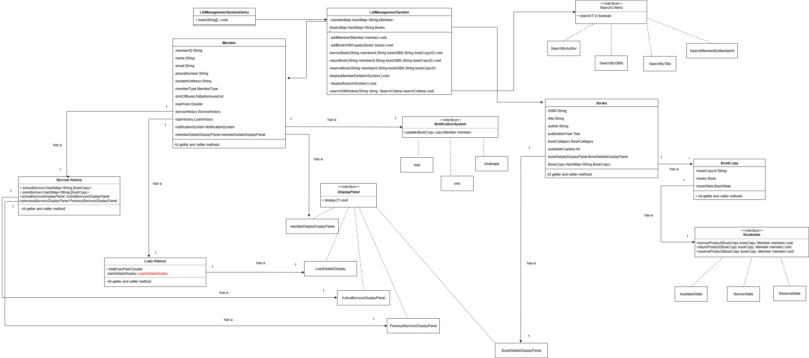

# Library Management System 

## Problem Statement

Design and implement a Library Management System that allows members to borrow and return books, manages book inventory, tracks loans, and supports search.

---

## Requirements

- **Book Management:** The system manages a category of books, each with multiple copies.
- **Member Management:** The system manages various library members who can borrow and return books.
- **Loan Management:** The system tracks which member has borrowed which book copy and current amount due paid by them.
- **Borrowing,Returning,Reserving:** Members can borrow available book copies and return them.Members can also reserve a borrowed book copy
- **Catalog Search:** Members can search for books by title, author, or ISBN and members by memberID.

---

## Core Entities

- **LibraryManagementSystem:** Main class that manages books, members, displayPanel.
- **Book:** Represents a book with title, author, ISBN,Category and other metadata.
- **BookCopy:** Represents a physical copy of a book, with a unique book Copy ID and has availability status.
- **BookState:** Represents the availability status of the book copy.It can be either Available,Reserved,Borrowed.
- **Member:** Represents a library member with a unique ID and name,email and other meta data.
- **Loan History:** Represents a loan record of the current dues paid by the member till date.
- **Borrow History:** Represent the active and previous borrows of the member. 
- **Notification system:** Represent the mode using which the user needs to be notified.

---

## Class Design

### 1. LibraryManagementSystem
- **Fields:** HashMap<String,Member> memberMap,HashMap<String,Books> booksMap
- **Methods:** addMember(Member),addBookWithCopies(Books),borrowBook(Member,Book,BookCopy),returnBook(Member,Book,BookCopy),reserveBook(Member,Book,BookCopy),etc.

### 2. Book
- **Fields:** String title, String author, String isbn,Year publicationYear,BookCategory bookCategory,Integer availableCopies,BookDetailsDisplayPanel bookDetailsDisplayPanel,HashMap<String,BookCopy> bookCopies
- **Methods:** All getter methods

### 3. BookCopy
- **Fields:** String bookCopyId, Book book,BookState bookState
- **Methods:** All getter and setter methods

### 4. BookState
- **Methods:** borrowProduct(BookCopy,Member),returnProduct(BookCopy,member),reserveProduct(BookCopy,member)

### 5. Member
- **Fields:** String memberID,String name,String email,String phoneNumber,String residentAddress,MemberType memberType,Integer limitOfBooksToBeBorrowed,Double loanFees,BorrowHistory borrowHistory,LoanHistory loanHistory,NotificationSystem notificationSystem,MemberDetailsDisplayPanel memberDetailsDisplayPanel
- **Methods:** All getter methods

### 6. Loan History
- **Fields:** Double totalFeesPaid, LoanDetailsDisplay loanDetailsDisplay
- **Methods:** All getter methods and calculate(Member) 

### 7. Borrow History
- **Fields:** HashMap<String,BookCopy> activeBorrows, HashMap<String,BookCopy> prevBorrows,ActiveBorrowsDisplayPanel activeBorrowsDisplayPanel,PreviousBorrowsDisplayPanel previousBorrowsDisplayPanel
- **Methods:** all getter and setter methods

### 8. Notification System
- **Methods:**  update(BookCopy,Member)

---

## Demo

See `LibManagementSystemDemo.java` for a sample usage and simulation of the library management system.

---
