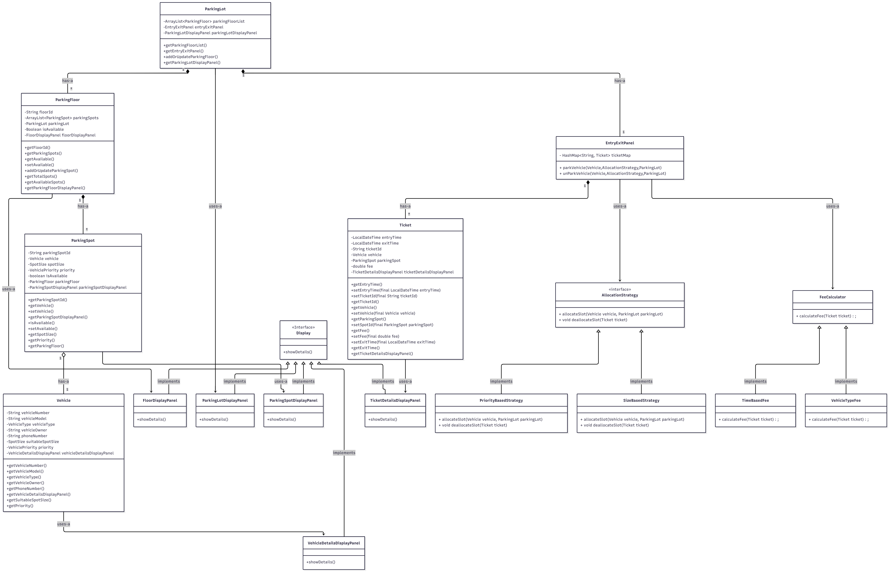

# Smart Parking Lot System

## Problem Statement

Design and implement a smart Parking Lot System that efficiently manages parking spaces, tracks vehicle entries and exits, and calculates parking fees based on duration of stay. The system should support different types of vehicles (e.g., cars, motorcycles, trucks) and provide real-time availability of parking spots to users.

---

## Functional Requirements

- **Parking Spot Allocation:** Automatically allocate parking spots based on vehicle type and availability.
- **Check-in and Check-out:** Record vehicle entry and exit times to calculate parking duration.
- **Fee Calculation:** Calculate parking fees based on duration of stay and vehicle type.
- **Real-time Availability:** Provide real-time updates on available parking spots.

---

## Core Entities

- **Vehicle:** Represents a Vehicle with attributes like vehicle number, type (car, motorcycle, truck),Size(Large,Medium,Small),Priority and owner details.
- **ParkingSpot:** Represents a parking spot with attributes like spot ID, supportedSize (Large,Medium,Small),SupportedPriority and availability status.
- **ParkingFloor:** Represents a parking floor containing multiple parking spots.
- **ParkingLot:** Represents the entire parking lot containing multiple parking floors.
- **Ticket:** Represents a parking ticket issued to a vehicle upon entry, containing entry time, exit time, and fee details.
- **Payment:** Represents the payment details for parking fees.The fee is calculated using various strategies based on vehicle type and duration of stay.
- **EntryExitGate:** Represents entry and exit gates for vehicles where vehicle is parked and unParked using various allocation strategies.
- **DisplayPanel:** Represents a display panel showing real-time availability of parking spots.

---

## Class Design

---

## Demo

See `SmartParkingLotSystemDemo.java` for a sample usage and simulation of the parking lot system.

---
